## Getting Started with LLDB

All tests in this report were run on Ubuntu Ubuntu 24.04.3 LTS

First, I installed LLDB:

```bash

sudo apt install lldb

```

Then I installed the dependencies, and To install Rust from "rustup.rs", I used this command:

```bash

curl --proto '=https' --tlsv1.2 -sSf https://sh.rustup.rs | sh

```

During the installation period, I choose the standard installation options. 

Next, I cloned the repository used for the examples:

```bash
git clone https://github.com/hhgitmax/gdb-lecture.git
cd gdb-lecture

```

The repository has two relevant subfolders: chech-pin and concat. First I built both programs:

```bash
cd check-pin
cargo b

cd concat
cargo b

```

Build output:

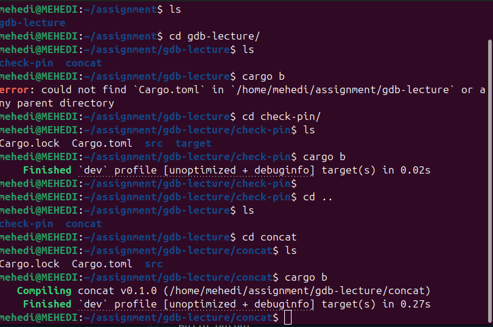

Before starting analysis, I confirmed that "rust-llb" available: 

```bash
rust-lldb --version

```

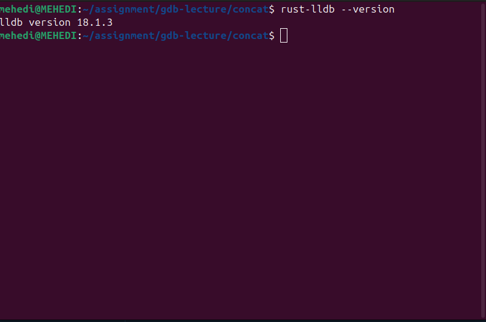


## 1. Watching a Value Change in a Loop

For this task, I used the "concat" program. The faulty "concat" function builds a string by counting fown from n to 0. 

Then I launched LLDB with the compiled binary:

```bash
cd concat
rust-lldb target/debug/concat
```

Inside LLDB, I set a breakpoint on "concat" and started execution: 

```bash
(lldb) breakpoint set --name concat::concat
(lldb) run
```
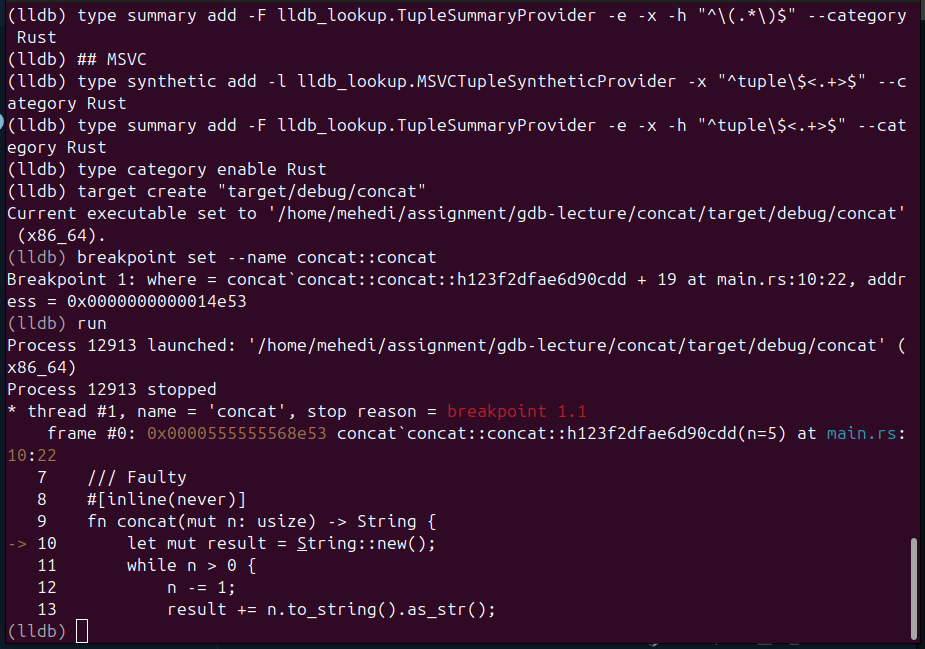

After hitting the breakpoint, I Stepped into the loop with "next" and inspected locals:

```bash

(lldb) next
(lldb) frame variable
```
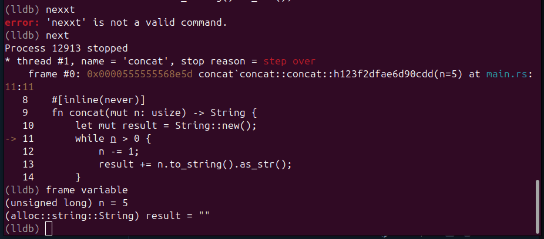

I then tried to watch "result" directly:


```bash
(lldb) watchpoint set variable result

```

But unfortunately It failed:


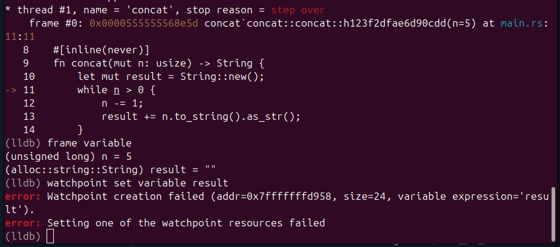


This happend because Rust "string" is internally a 24 byte struct (pointer, length, capacity), while hardware watchpoints in LLDB are limited to only 1, 2, 4, or 8 bytes. 

I also tried watching "len" directly" 

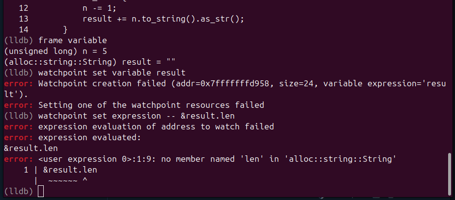


But this also failed because "len" is a method in Rust, not a directly addressable field:


As a workaround, I set a breakpoint on line 13 where "result" is modified and attached a command to print "result" each time that breakpoint is hit:


```bash
(lldb) breakpoint set --file main.rs --line 13
(lldb) breakpoint command add 1
> frame variable result
> DONE

```


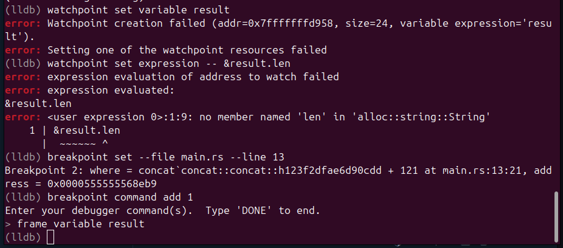


Then I tried the execution:

```bash

(lldb) continue
```


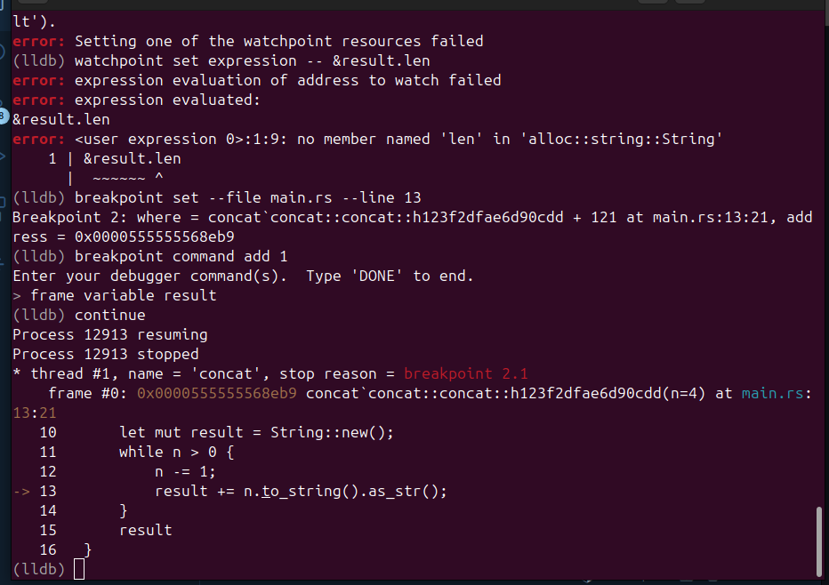


This approach took more steps than in GDB, where "watch result" can be more straightforward. In LLDB, a breakpoint with an attached print command is a practical workaround for composite Rust types. 


## 2. Modifying a Return Value from False to Tue

For this task, I used "check-pin", which compares user input against a hardcoded PIN and prints either "Access granted " or "Access denied". 


```bash
cd ../check-pin
rust-lldb target/debug/check-pin
```

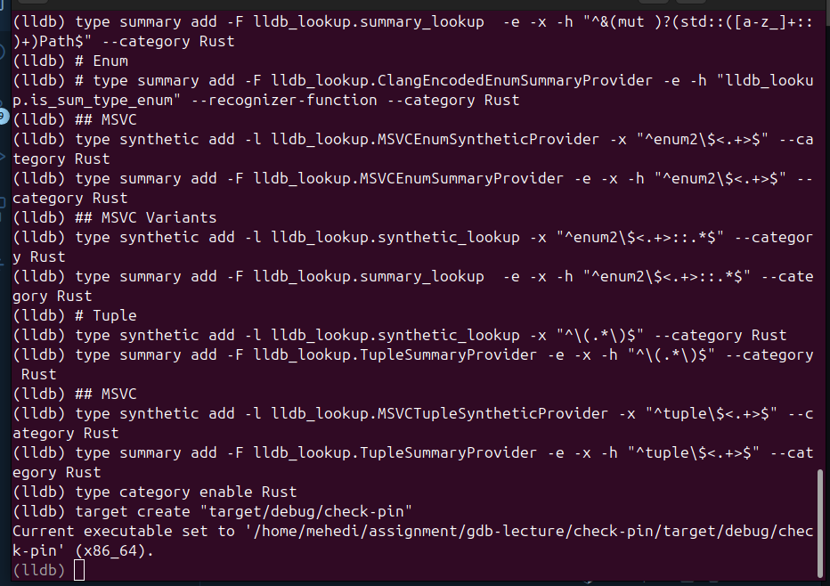
Thwn I set a breakpoint on "check-password", ran the program, and entered an incorrect PIN:

```bash
(lldb) breakpoint set --name check_pin::check_password
(lldb) run

```

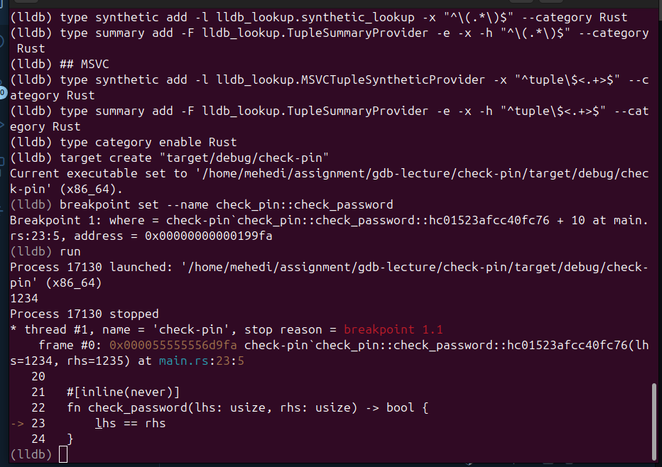

After putting the wrong input, execution paused at the breakpoint. I used "finish" to return from the function and inspected "rax":

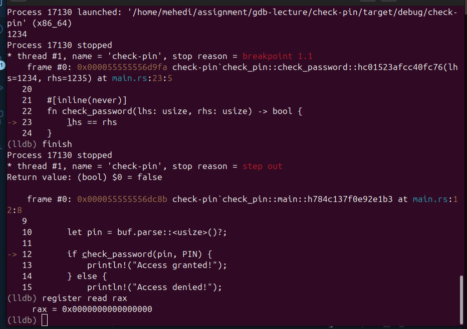

On 86_64 SysV ABI, function return values are placed in rax. I changed it to 1 (true) before resuming:

```bash
(lldb) register write rax 1
(lldb) register read rax
(lldb) continue
```

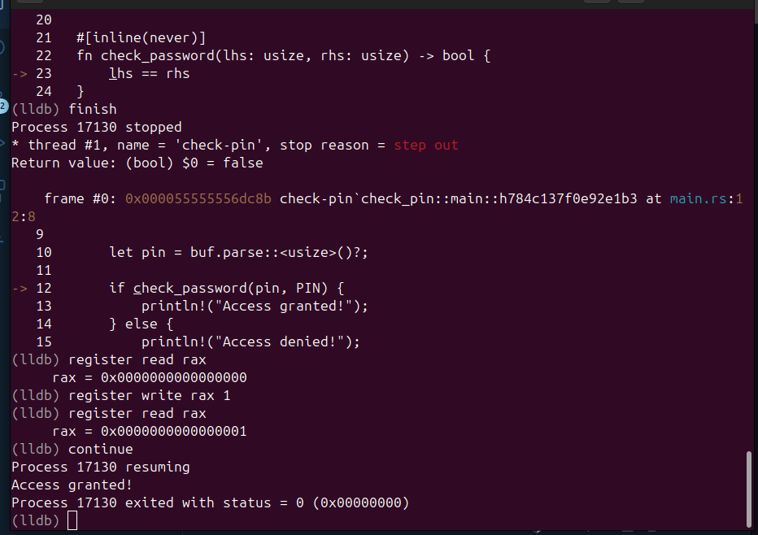

## 3. Modifying a Function Argument:

This task can be done either by changing a local variable or by changing registers directly. I used register manipulation. 

# Register Manipulation

I set a breakpoint on "check-password" and edited argument registers. On x86_64 SysV ABI, the first argument is passed in rdi and the second in rsi:

```bash
(lldb) breakpoint set --name check_pin::check_password
(lldb) run
```

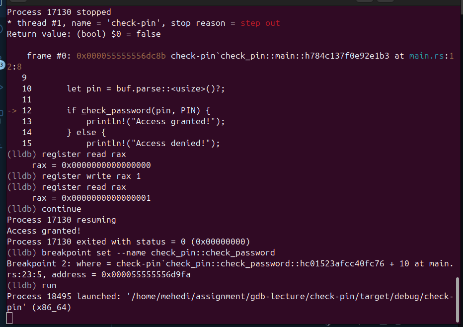

```bash

(lldb) register read rdi rsi
(lldb) register write rdi 1235
(lldb) register write rsi 1235
(lldb) register read rdi rsi
(lldb) continue
```


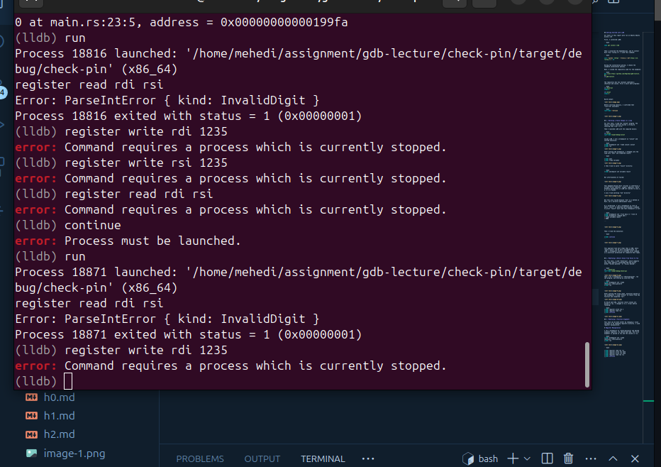

Unfortunately I am having problem, I dont know why. But it should return Access granted. 

## Comparison GDB vs LLDB

# Did I find it easier?

Yes, I found LLDB to be slightly easier to use than GDB. While GDB is very powerful, but LLDB’s commands are more consistent and easier to remember. For example, instead of remembering different shortcuts, LLDB uses a clear "command-action-object" style (like watchpoint set variable) .


## Which tool would I use, and when?

Use LLDB (and rust-lldb) for Rust development: Since Rust is built using LLVM technology, LLDB works more naturally with it. The rust-lldb wrapper is especially helpful because it formats complex Rust data (like Strings and Vectors) so they are easy to read instead of showing raw memory addresses.

Use GDB for older Linux systems: I would use GDB if I am working on a very old Linux server or a non-LLVM project, as GDB has been the standard for decades and is available on almost every Unix-like system.