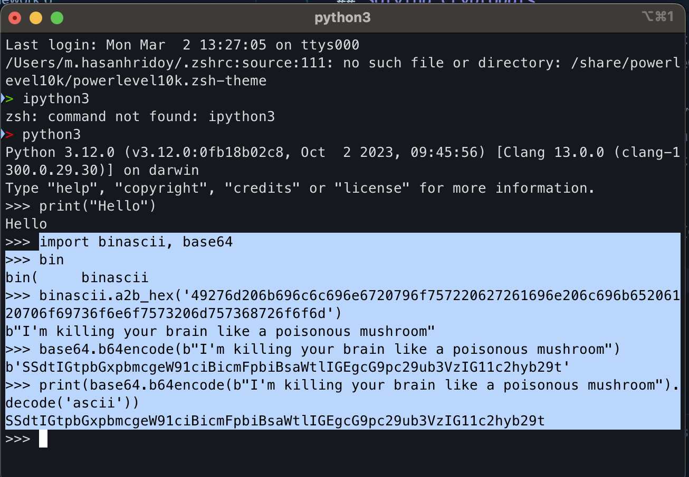
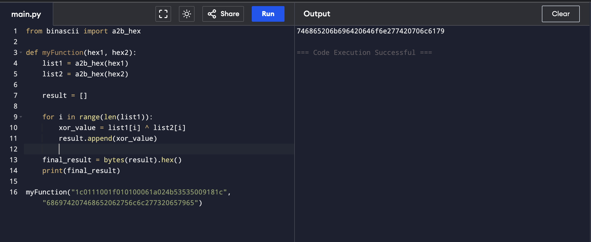
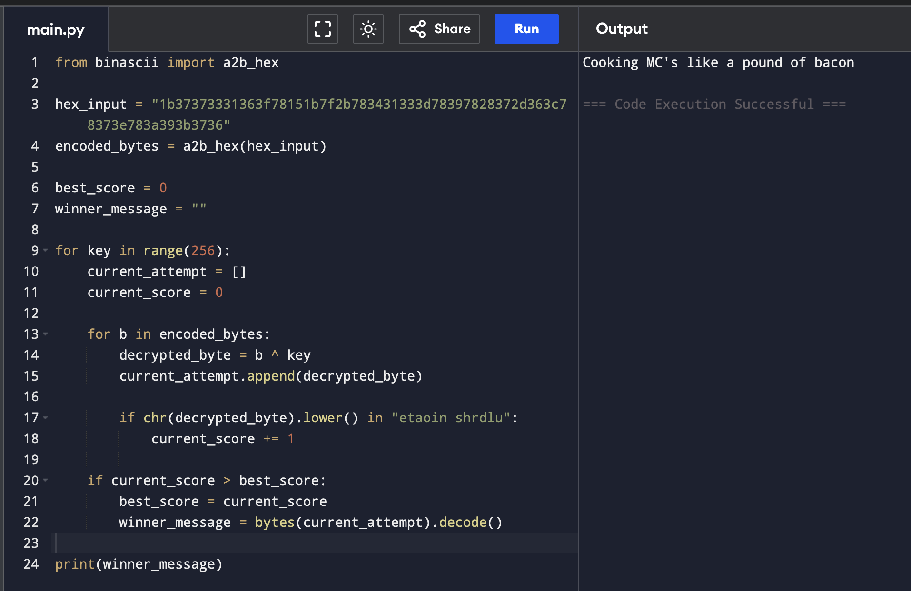
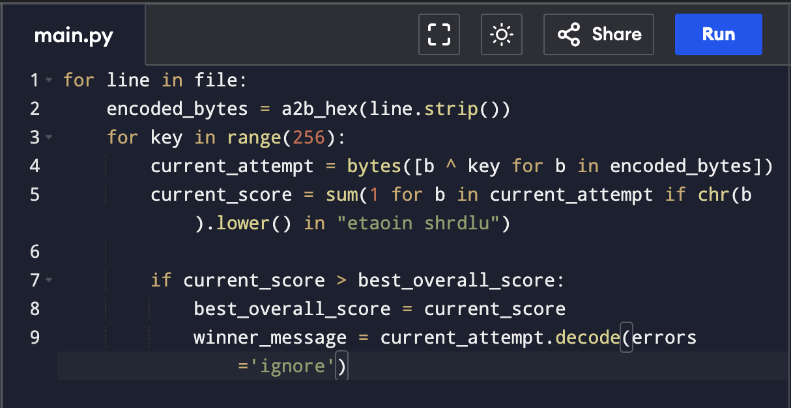

## Solving Cryptopals

I am using my M1 mac. It have already installed python3 in it's terminal. So there is no need to install. 

Crypto Challenge Set 1

1. Convert Hex to Base64

In here we need to convert the Hex String to Base64. First I import two libraries called "binascii" and "base64". 

Then convert the Hex String to raw bytes. For this I used "a2b_hex". Then what I got " b"I'm killing your brain like a poisonous mushroom" " I paste in the b64encode. And this gives me the expected output and " .decode("ascii") " is for the clean output. 

SSdtIGtpbGxpbmcgeW91ciBicmFpbiBsaWtlIGEgcG9pc29ub3VzIG11c2hyb29t

2. Fixed X-or

The function myFunction takes two hex values and converts them into bytes using a2b_hex from the binascii module. Then it XORs the corresponding bytes of the two inputs and stores the result. Finally, the result is converted back into a hexadecimal string and printed.

3. Single-byte XOR cipher

I tried brute-forcing all 256 possible single-byte keys through a loop. For each key, it performs a bitwise XOR  against every byte of the data to try and "unlock" it. It then scores the result by counting how many common English letters (like "e", "t", "a") or spaces appear. The code only saves the message if its score is higher than the previous "high score," eventually leaving you with the most readable English sentence.

4. Detect single-character XOR

I tried a nested loop to solve this. As this exercise is extend version of exercise 3, I just implement the loop. The outer loop reads every line in the file one by one, while the inner loop tests all 256 possible keys against that specific line. It performs a bitwise XOR, calculates an English "frequency score" for the result, and only saves the message if it beats the highest score found in the entire file.

## Sources

- [h7 Uhagre2 — Course assignment page](https://terokarvinen.com/application-hacking/#h7-uhagre2-tero)
- [Python for Hackers — Tero Karvinen](https://terokarvinen.com/python-for-hackers/)
- [Python file.readlines() — w3schools](https://www.w3schools.com/python/ref_file_readlines.asp)