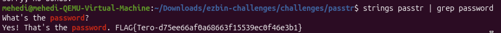
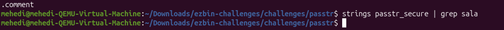
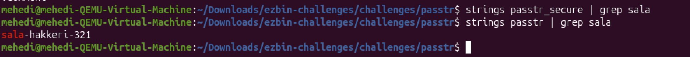
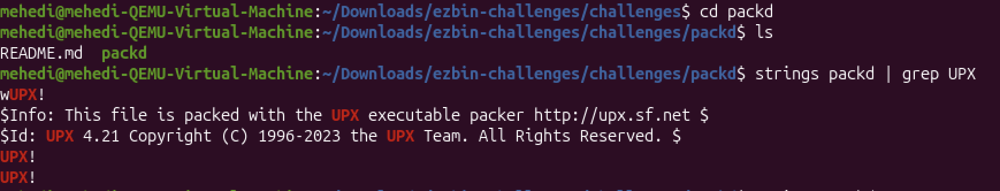
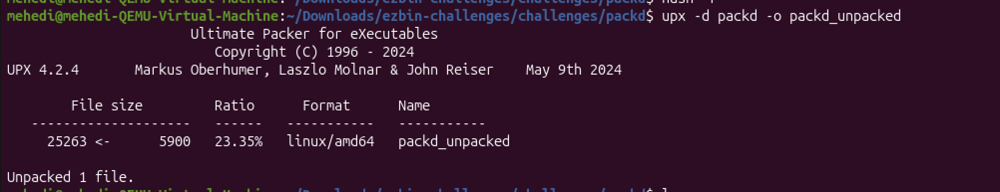

# Static Analysis and Obfuscation Report

**Date:** 2026-01-28  
**Student:** [Mehedi Hridoy]  
**Course:** Application Hacking and Vulnerabilities - ICI012AS3AE-3001

## 1. Environment and Setup

I did these exercises on my MacBook Air (M1, 2020). I used a virtual machine called UTM to run Ubuntu Linux. The shell I used was bash. Because the target programs were made for Linux x86_64, I had to install some standard libraries.


## 2. Part A: Strings Analysis
**Goal:** Find the plaintext password and flag hidden inside the `passtr` binary.

I started by downloading the challenge archive `ezbin-challenges.zip`. I extracted the contents using the `unzip` command:
```bash
unzip ezbin-challenges.zip
cd ezbin-challenges
cd challenges
cd passtr
```

Then I used the strings utility to print the printable character sequences from the binary. This tools is stastandard for identifying hardcoded literals in compiled programs.
```bash
strings passtr | grep password
```

I filtered the output to look for the word "password" or typical flag formats. The output displayed the prompt "Enter password:" followed immediately by a suspicious string.

Result: The password found was: sala-hakkeri-321 The flag found was: FLAG{Tero-d75ee66af0a68663f15539ec0f46e3b1}



## Part B: Obfuscation (Hiding the Password)

**Goal**: Create a version of the password program where the secret cannot be found using strings.

I wrote a new C program named passtr_secure.c. Instead of defining the password as a string literal (char *p = "secret"), which would be stored in the binary's data section, I used the Stack String technique. I assigned the password character-by-character to a char array. This forces the compiler to generate individual MOV instructions for each character, preventing a continuous readable string from existing in the compiled file.


The Code (passtr_secure.c):
```c
#include <stdio.h>
#include <string.h>

int main() {
    char password[20];
    
    // OBFUSCATION: We build the password "sala-hakkeri-321" character by character.
    char secret[17];
    secret[0] = 's';
    secret[1] = 'a';
    secret[2] = 'l';
    secret[3] = 'a';
    secret[4] = '-';
    secret[5] = 'h';
    secret[6] = 'a';
    secret[7] = 'k';
    secret[8] = 'k';
    secret[9] = 'e';
    secret[10] = 'r';
    secret[11] = 'i';
    secret[12] = '-';
    secret[13] = '3';
    secret[14] = '2';
    secret[15] = '1';
    secret[16] = '\0'; 

    printf("What's the password?\n");
    scanf("%19s", password);

    // Compare the user input with our built-up secret
    if (0 == strcmp(password, secret)) {
        printf("Yes! That's the password. FLAG{Tero-d75ee66af0a68663f15539ec0f46e3b1}\n");
    } else {
        printf("Sorry, no bonus.\n");
    }
    return 0;
}
```

I compiled the program using gcc on my local machine:
```bash
gcc passtr_secure.c -o passtr_secure
```

I then tested the binary to ensure the functionality was correct. I ran ./passtr_secure and entered sala-hakkeri-321. The program accepted the password.

Proving the Obfuscation

To verify that the password was successfully hidden, I ran the strings command on the new binary, searching specifically for the known password substring "sala".
```bash
strings passtr_secure | grep sala
```



**Observation**: 

The command returned no output (empty result). This confirms that the continuous string "sala-hakkeri-321" does not exist in the binary file, and a static analysis attacker would not be able to find it easily.

**The previous file**




## Part C: Analysis of Packed Binary ('packd')

**Initial Analysis & Hypothesis**

I first attempted to run strings packd but found no readable text resembling a flag. The output was mostly gibberish. I formed a hypothesis that the binary was packed (compressed). I searched for common packer signatures:
```bash
strings packd | grep UPX
```

**Observation:** The output contained UPX! and UPX 3.95, confirming the binary was compressed using the Ultimate Packer for eXecutables.



**Unpacking**

I utilized the upx tool to decompress the binary. I initially encountered a No such file error due to a previous Snap installation, which I resolved by running hash -r to clear the shell cache.
```bash
upx -d packd -o packd_unpacked
```

**Result:** The tool reported Unpacked 1 file.



**Retrieving the Secrets**

With the binary unpacked, I performed standard static analysis using strings on the new file packd_unpacked.
```bash

strings packd_unpacked | grep FLAG
```

**Found Flag:** FLAG{Tero-0e3bed0a89d8851da933c64fefad4ff2}


## Sources

    Karvinen, Tero: Application Hacking Course, 2024. https://terokarvinen.com/application-hacking/

    Linux Manual Pages: strings(1), upx(1). Accessed 2026-01-29.