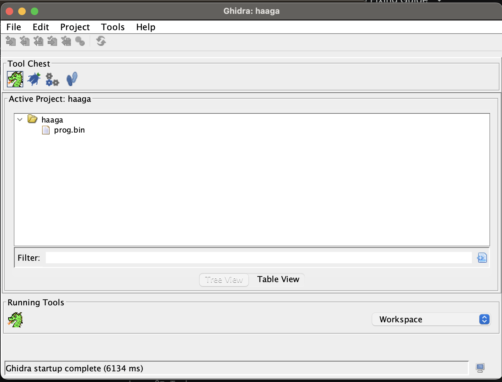
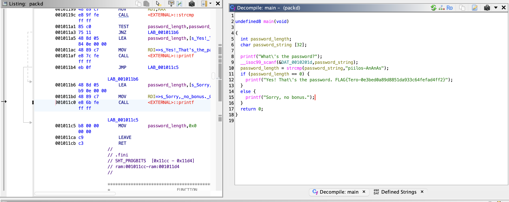
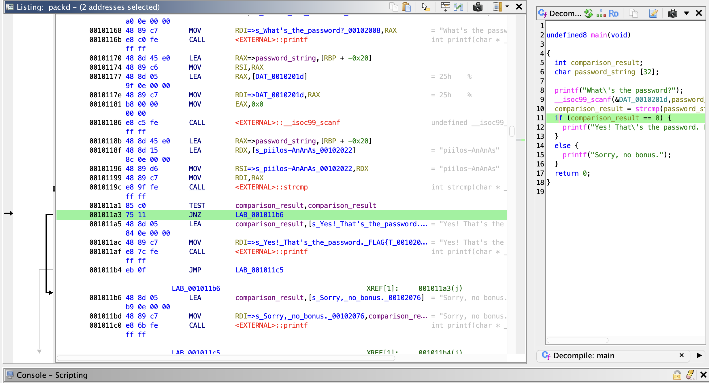
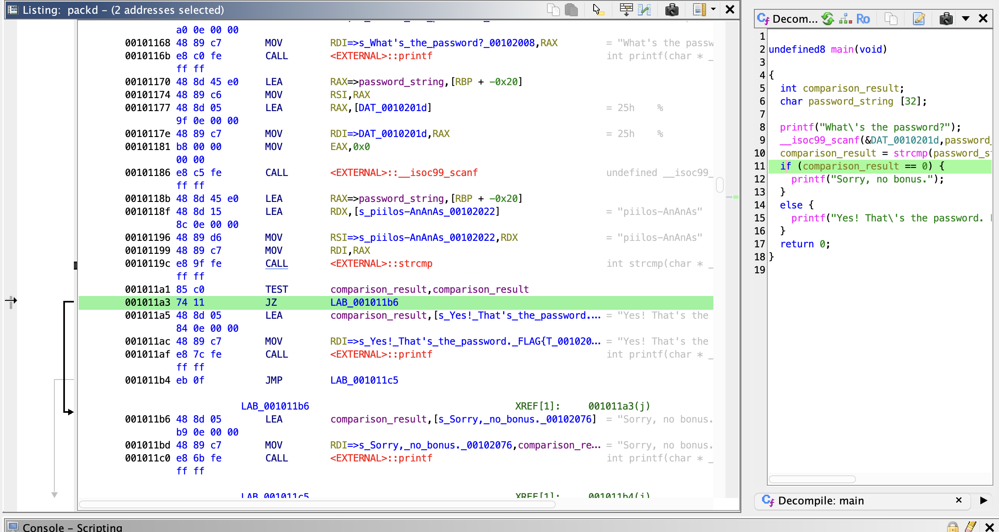
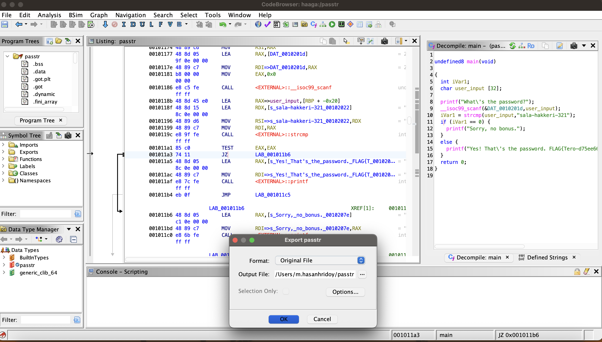
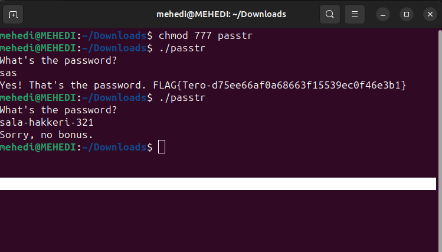
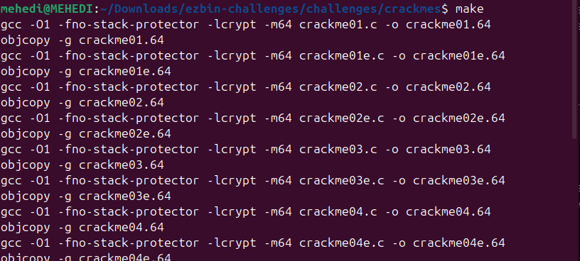
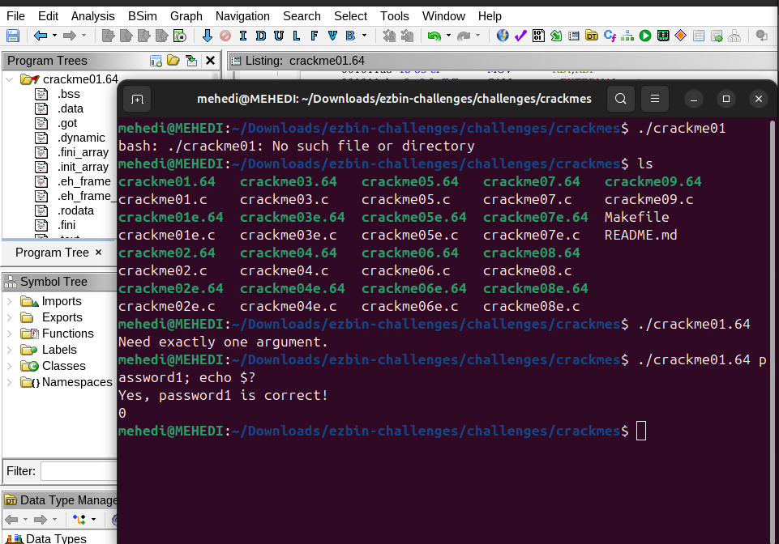

# Read / Watch and Summarize

The Video demonstrates using Ghidra, a reverse engineering tool developed by the NSA, to solve a challenge called "bbbloat". Ghidra's primary strength is its decomipler, which translates machine code back into the c-like code. This makes it much easier to understand the program logic compared to reading raw assembly. A crucial step in reverse engineering is we can rename generic variables to any names as we discover their purpose. Rhis clarifies the code flow. This video touches on the concept that binaries can be modified. However in this specific challenge, the gooal was to understand the logic to find the correct input flag rather than modifying the binary. 


# (a) Install Ghidra

I am using Ghidra in my mac, so I just use the command 

´´´Bash
brew install ghidra

# To Verify Ghidra, I attached the screenshot



# (b) Rever-C

I Reverse engineered the packd binary to C language with Ghidra. Then after finding the main program, I changed the variables to a meaningful name. 



Then I solved the task by changing the binary code, first I found the logic how actually the code has been written then understand the logic, I found that if i click in the  "if" logic then in the binary file it pointed at the "JNZ"



Then I used the patch instruction and changed the assembly instruction from "JNZ" to "JZ". Then the "if" condition just changed. Now if it matches with the right password then the program will print "Sorry, no bonus". 





# (c) if backwards

This task is also like the previous one. I decompiled the "passtr" then in the c style code I set the variables a descriptive names. And then i chaned the assembly instruction. I changed "JNZ" to "JZ". Then export the modified the program from Ghidra.



Then I run the modified executable file using 

```bash```
./passtr

And then If i give any passwords it said "yes that's the password". But when I give the correct password it reply "Sorry No bonus".




# (d) Nora-crack Me

I cloned the "NoraCodes" repository from github. Then use "make" to compile the program.



# (e) Nora crackme01
In here I decompiled the crackme01.64 in ghidra. Then find the main function. Analyze the assembly file and the code. go to the terminal and check with "echo"

'''bash
./crackme01 password1; echo $?

Then it prints "Yes password1 is correct. 0 "

