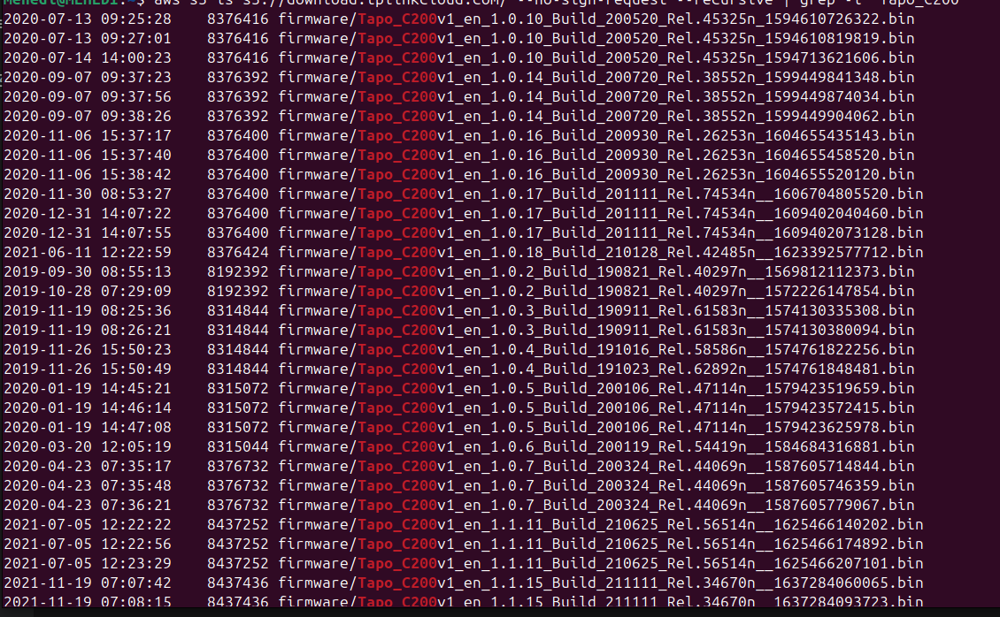
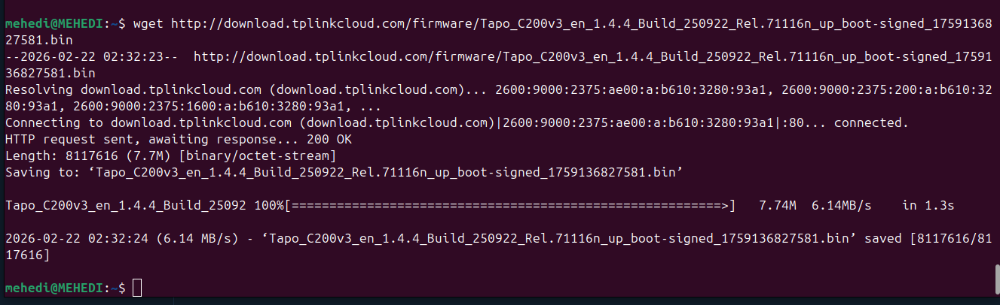
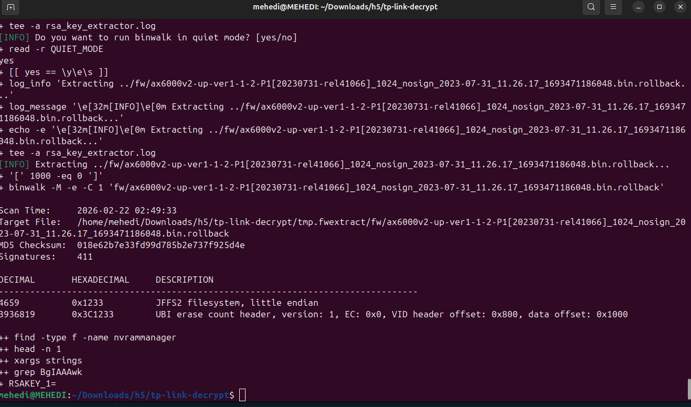
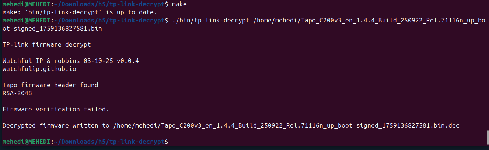
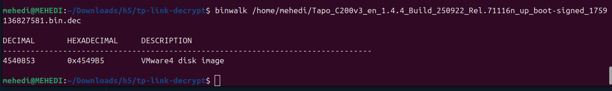

## Investigation Report: TP-Link Tapo C200 Vulnerabilities

# Target: TP-Link Tapo C200 Camera (Firmware Analysis)

(a) How did you obtain the file?

Since I don't have the physical access to the device, I searched the firmware on google and the firmware had to be sourced via Open Source Intelligence (OSINT). Based on network traffic analysis of the Tapo Android app, TP-Link hosts its firmware updates on an Amazon AWS S3 bucket.

Crucially, this S3 bucket (s3://download.tplinkcloud.com/) is configured with public, unauthenticated read access.

But First I need to set up the AWS CLI

*** Setting up AWS CLI ***

```bash
sudo snap install aws-cli --classic
```


Crucially, this S3 bucket (s3://download.tplinkcloud.com/) is configured with public, unauthenticated read access.

I obtained the file by using the AWS Command Line Interface (CLI) to bypass the need for credentials and directly list the contents of the bucket:

*** Finding the target Firmware ***
```bash
aws s3 ls s3://download.tplinkcloud.com/ --no-sign-request --recursive | grep -i "Tapo_C200"

```


I found this 


Downloading the right version for me:

Once a specific version was identified v1.4.4, I downloaded the .bin firmware file directly using wget.

```bash
wget http://download.tplinkcloud.com/firmware/Tapo_C200v3_en_1.4.4_Build_250922_Rel.71116n_up_boot-signed_1759136827581.bin

```



### Fixing tp-link-decrypt

First we need to download and Prep the Decryptor. First, we need to clone the decryption tool and run its setup scripts. 

```bash
git clone https://github.com/robbins/tp-link-decrypt.git
cd tp-link-decrypt
```

Install the required tools and extract the encryption keys:

```bash
./preinstall.sh
./extract_keys.sh

```




Run the decryptor:

```bash
./bin/tp-link-decrypt /home/mehedi/Tapo_C200v3_en_1.4.4_Build_250922_Rel.71116n_up_boot-signed_1759136827581.bin

```



Run Binwalk
Now we can finally use Binwalk to look inside

Scan the file to see the structure:

```bash

binwalk /home/mehedi/Tapo_C200v3_en_1.4.4_Build_250922_Rel.71116n_up_boot-signed_1759136827581.bin.dec
```



Then Extract the actual folder:

```bash
binwalk -e /home/mehedi/Tapo_C200v3_en_1.4.4_Build_250922_Rel.71116n_up_boot-signed_1759136827581.bin.dec
```

Then after verifying the files are there, we found folders like bin/, etc/, and usr/, we have successfully "hacked" into the camera's OS.

