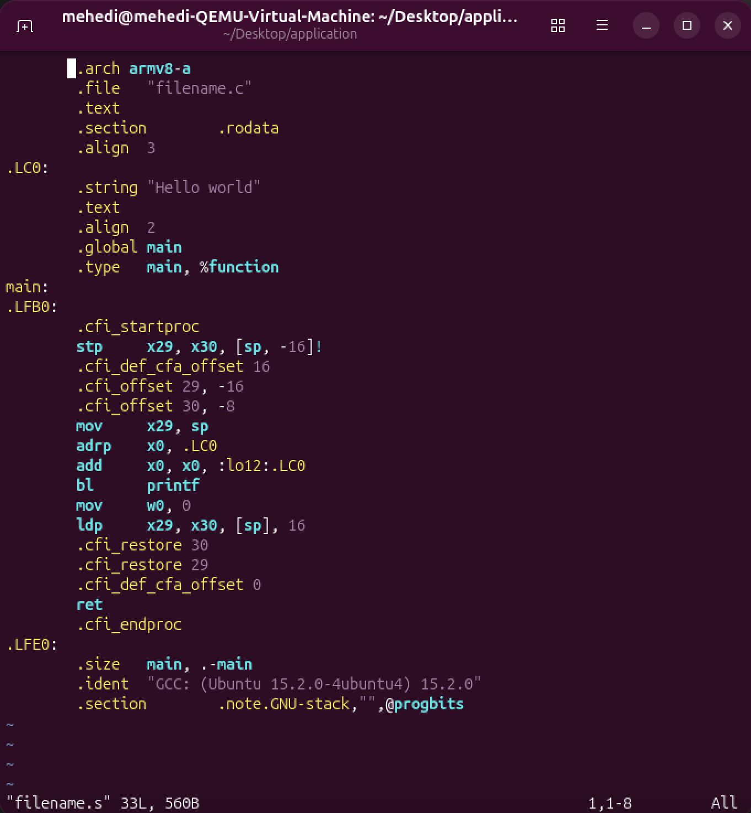
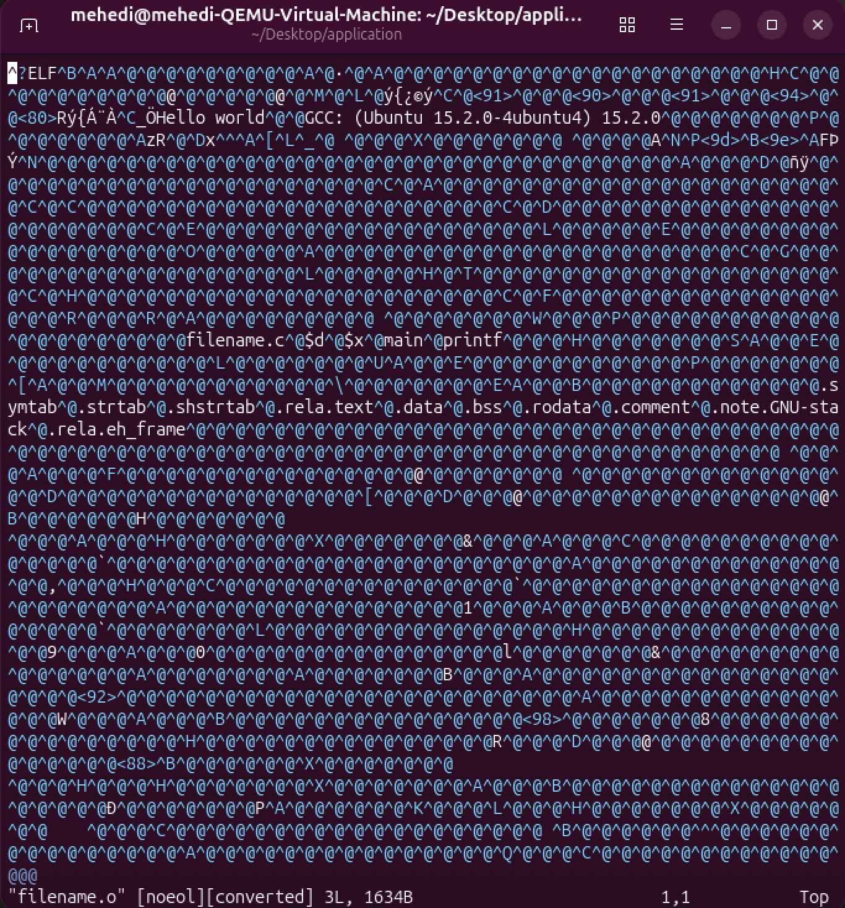

# First Exercise
# C Program Compilation Process Report

## Overview
This report documents the complete compilation process of a C program in Ubuntu Linux, explaining each phase of the transformation from source code to executable binary.

## Step-by-Step Compilation Process

### 1. Create the Source File
I create a new C source file using my preferred editor:
```bash
vi filename.c
```

### 2. Compile the Program
I compile the source code to generate an executable:
```bash
gcc filename.c -o filename
```

### 3. Execute the Program
Run the compiled executable:
```bash
./filename
```

### 4. View the Compilation Phases
To see all intermediate files created during compilation, use the `-save-temps` flag:
```bash
gcc -Wall -save-temps filename.c -o filename
```

## Compilation Output Files

This command generates the following output files:
- `filename.c` - Original source code
- `filename.i` - Preprocessed file
- `filename.s` - Assembly source file
- `filename.o` - Object file (machine code)
- `filename` - Final executable


## Intermediate Stages

### Assembly Level Instructions
The `.s` file contains assembly-level instructions that are generated from the C source code:



### Object File (Machine Code)
The `.o` file contains machine-level instructions. At this phase, the compiler converts the source code into machine language that the processor can execute:



