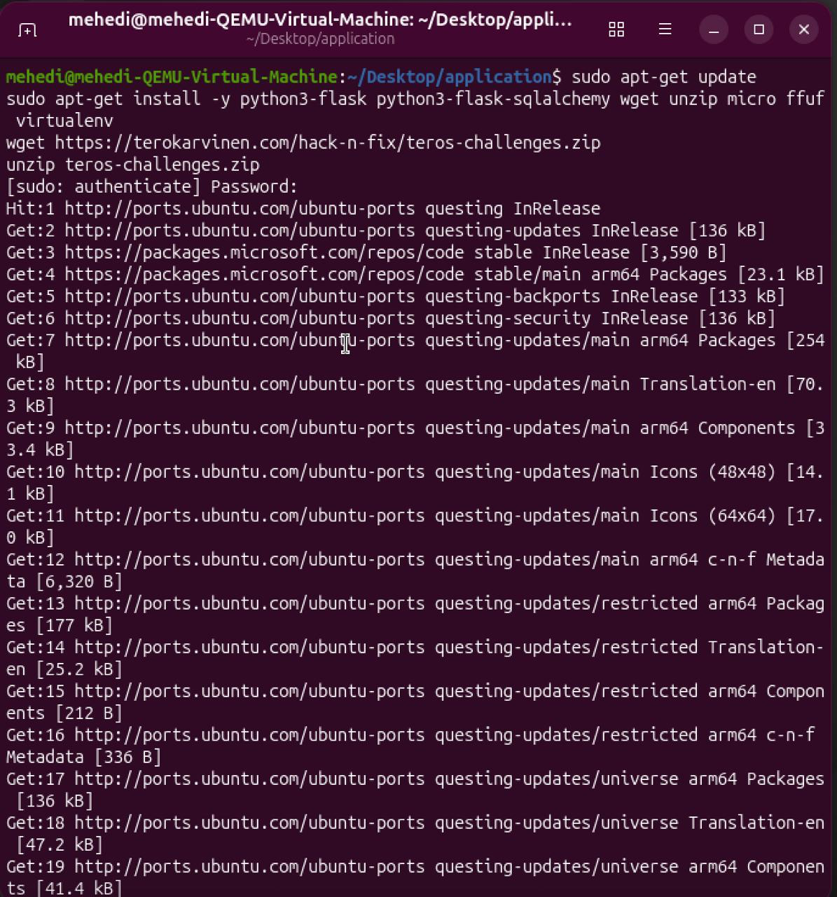
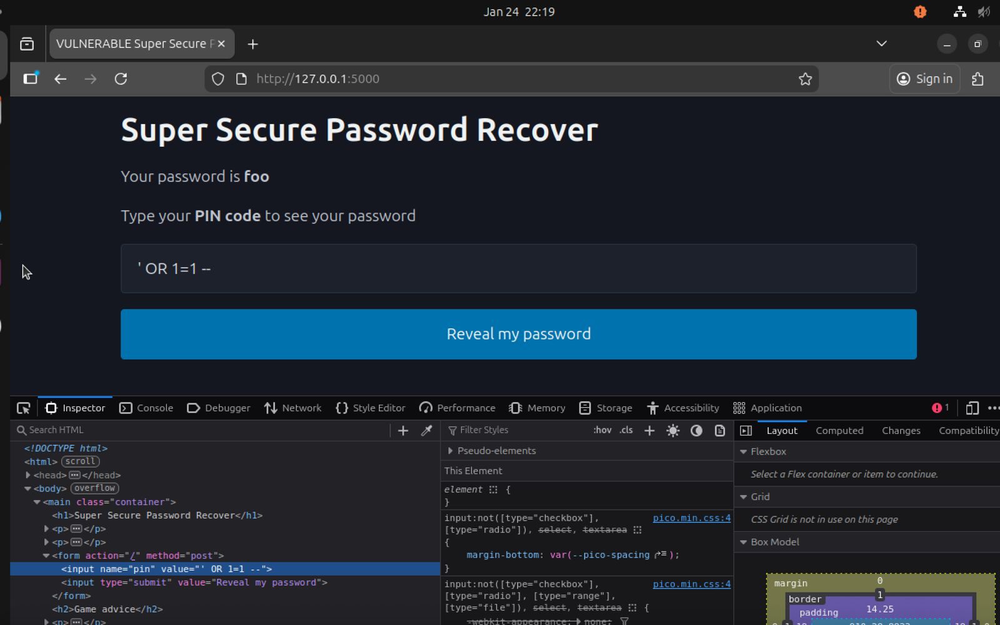
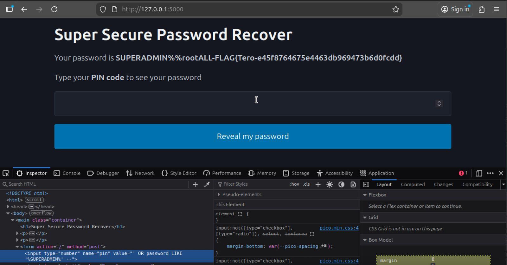
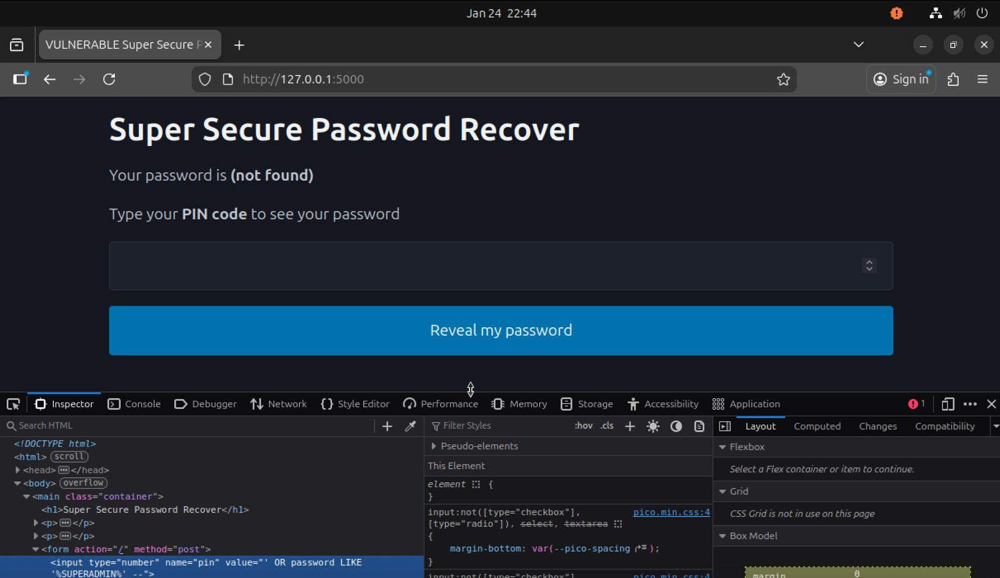
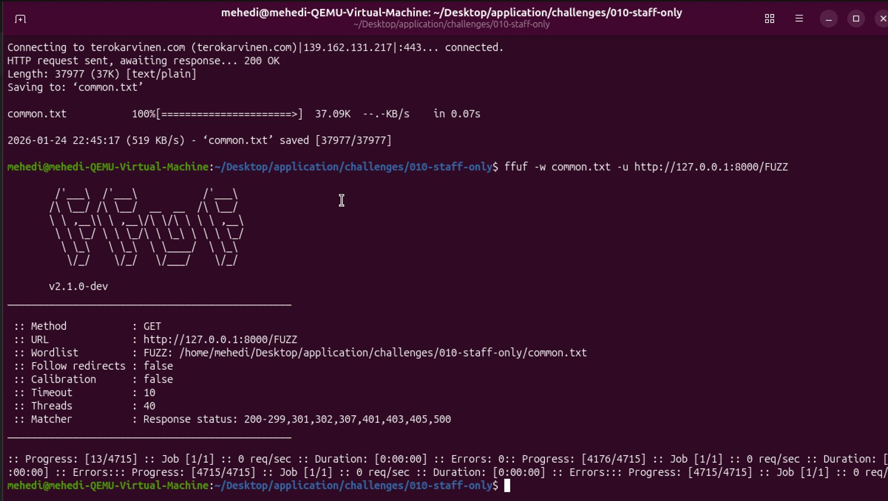
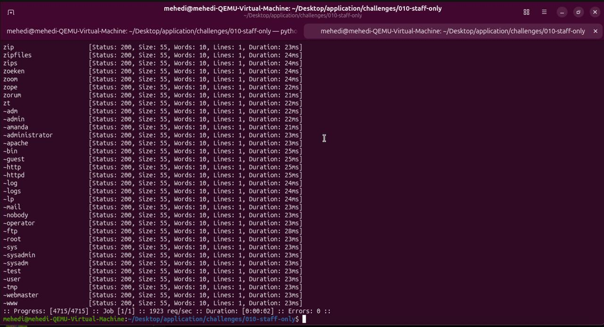
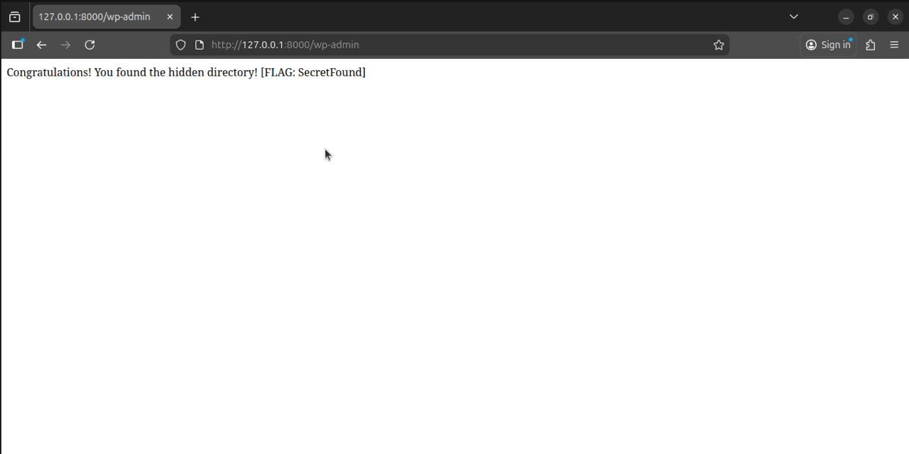
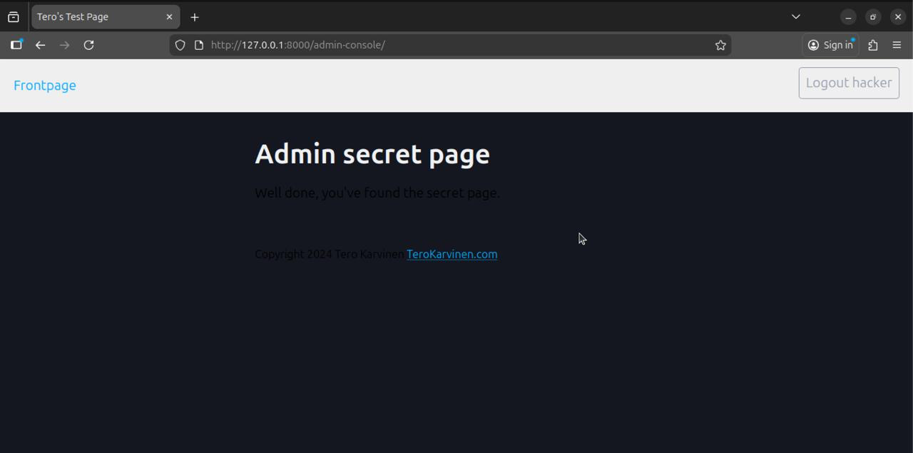
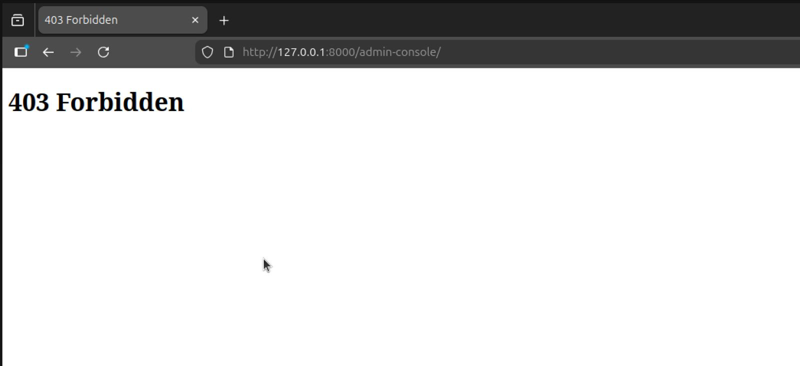

Here is the text formatted into organized Markdown.

## Break & Unbreak

### OWASP Top 10: A01 – Broken Access Control

**Broken Access Control** is the most serious web security problem. It means a website does not properly control what logged-in users are allowed to do. Because of this, users can access data or actions they should not be able to.

**Common attacks:**

* **IDOR (Insecure Direct Object References):** A user changes a value in the URL, such as changing `id=123` to `id=124`, to see another user’s information.
* **Privilege Escalation:** A normal user is able to act like an admin without permission.

**Prevention:**
Developers must check permissions on the server side for every request. The system should use a “deny by default” rule, meaning no access is allowed unless it is clearly permitted.

---

### Karvinen 2023: Finding Hidden Web Directories with ffuf

**ffuf (Fuzz Faster U Fool)** is a fast tool used to find hidden folders and files on a website that are not visible in menus or links.

**How it works:**
ffuf uses a wordlist (for example: `admin`, `login`, `backup`) and tries each word in the website URL to see if the page exists.

**Filtering results:**
Most attempts return a **404 Not Found** error. To find real pages, testers filter out these common responses, often by filtering response size (`-fs`). This helps reveal real pages that return **200 OK** or **403 Forbidden**.

---

### PortSwigger: Access Control Vulnerabilities

Access control problems are grouped into two types:

1. **Vertical Privilege Escalation:** A user gets access to features meant for higher roles, such as a normal user accessing the admin panel.
2. **Horizontal Privilege Escalation:** A user accesses another user’s data at the same permission level, such as viewing someone else’s private photos.

---

### PortSwigger: SQL Injection (SQLi)

**SQL Injection** happens when user input is directly added into a database query. This allows attackers to change how the query works.

**Retrieving hidden data:**
By changing the query logic (for example adding `OR 1=1`), an attacker can force the database to return all data in a table.

**Prevention:**
The best and safest solution is **Parameterized Queries (Prepared Statements)**. These make sure user input is treated as data, not as executable SQL code.

---

### Karvinen 2006: Report Writing

A good penetration testing report should follow the **scientific method**, meaning the results must be repeatable.

**Structure:**
The report should clearly describe:

* The environment (operating system, tools used)
* What was tested
* The results

**Clarity:**
Another person should be able to follow the report step by step and get the same results. Sources must be cited so it is clear what comes from the author and what comes from other references.

---

### Student: Mehedi | Course: Application Hacking (Tero Karvinen)

#### Environment

* **OS:** Ubuntu 24.04 LTS (Running on QEMU Virtual Machine / Apple Silicon Host)
* **Hardware:** Apple M-Series (ARM64 architecture) requires QEMU emulation for x86 binaries.
* **Tools:** Python 3, ffuf, micro, Firefox.
* **Network:** Tests performed on localhost (`127.0.0.1`) to ensure safety.

---

### a) Break into 010-staff-only

**Installation & Setup**

I started by installing the necessary Python dependencies and the Flask framework required to run the target application.

**Commands:**

```bash
sudo apt-get update
sudo apt-get install -y python3-flask python3-flask-sqlalchemy wget unzip micro ffuf virtualenv

```


After installation, I downloaded the challenge, unzipped it, and started the application:

```bash
python3 staff-only.py

```

**Hack**

* **Method:** I accessed the application at `http://127.0.0.1:5000`. The target was a PIN code login form.
* **Client-Side Bypass:** The input field was restricted to numeric values only (`type="number"`). I bypassed this by inspecting the element in Firefox (**Right Click -> Inspect**) and changing the attribute to `type="text"`.
* **SQL Injection:** I injected a payload designed to bypass the password check and search specifically for the "SUPERADMIN" user.

**Payload:**

```sql
' OR password LIKE '%SUPERADMIN%' --

```


* **Vulnerability:** The application suffered from **SQL Injection (SQLi)**. The user input was directly concatenated into the SQL command string, allowing me to alter the query logic.

**Exploit Explanation:**

* `'` closed the intended string.
* `OR ...` added a condition that is always true for the target row.
* `--` commented out the rest of the query.

**Result:** The application executed the injected code and returned the secret flag.

*Figure 3: Success! The application reveals the Superadmin flag.*


---

### b) Fix the 010-staff-only vulnerability

**Fix**

**The Mistake:** I examined the source code using `micro`. The vulnerability was in the SQL query construction:

```python
# Vulnerable Code
sql = "SELECT password FROM pins WHERE pin='"+pin+"';"

```

The programmer made the mistake of trusting user input and pasting it directly into the database command.

**The Solution:** I modified the code to use **Parameterized Queries**. This separates the code (SQL) from the data (User Input).

```python
# Fixed Code
sql = text("SELECT password FROM pins WHERE pin=:pin;")
res = db.session.execute(sql, {"pin": pin})

```

**How it works:** The database engine now treats the input variable `:pin` strictly as data. Even if the input contains SQL commands like `' OR 1=1`, they are treated as a literal string of text, not executable code.

**Verification**

I saved the changes, restarted the server, and attempted the exact same attack again. This time, the application did not reveal the password, returning "(not found)" instead.

*Figure 4: The attack fails after applying the code fix.*


---

### c) Solve dirfuzt-1

**Installation & Setup**

I downloaded the `dirfuzt-1` binary and the `common.txt` wordlist for fuzzing.

```bash
wget https://terokarvinen.com/2023/fuzz-urls-find-hidden-directories/dirfuzt-1
wget https://terokarvinen.com/2023/fuzz-urls-find-hidden-directories/Miessler-etal-2023-SecLists/common.txt
chmod +x dirfuzt-1
./dirfuzt-1

```

**Hack**

* **Method:** I used **ffuf** (Fuzz Faster U Fool) to brute-force directory names.
* **Vulnerability:** Security by Obscurity. The developer assumed that because the link was not in the navigation menu, no one would find it.

**Exploit Explanation:**

1. **Initial Scan:** I ran ffuf against the target URL.
```bash
ffuf -w common.txt -u http://127.0.0.1:8000/FUZZ

```


2. **Filtering Noise:** The initial scan returned thousands of "False Positives" (Status 200). I noticed that all the generic error pages had a response size of 55 bytes.
3. **Refined Scan:** I ran the command again, filtering out size 55:
```bash
ffuf -w common.txt -u http://127.0.0.1:8000/FUZZ -fs 55

```


*Figure 5: ffuf scan results, filtering out the noise to find the unique page.*



**Result:** The scan revealed one hidden directory: `wp-admin`. I visited the URL `http://127.0.0.1:8000/wp-admin` in my browser and found the hidden flag.

*Figure 6: Successfully accessing the hidden page found by the fuzzer.*


---

### d) Break into 020-your-eyes-only

**Installation & Setup**

This was a Django application, so I set up a virtual environment to manage dependencies safely.

```bash
virtualenv -p python3 env
source env/bin/activate
pip install -r requirements.txt
python3 manage.py migrate
python3 manage.py runserver

```

**Hack**

* **Method:** I registered a new user account named "hacker" and logged in. I then used **Forced Browsing** to access the admin area.
* **Vulnerability:** Broken Access Control (IDOR/Privilege Escalation). The application checked if I was logged in, but failed to check if I had admin permissions.

**Exploit Explanation:**
I manually typed the URL `http://127.0.0.1:8000/admin-console/` into the browser bar. Because the specific view for this page lacked a `is_staff` check, the server allowed my standard user to view the secret page.

**Result:** I gained access to the "Admin secret page" without having admin privileges.

*Figure 7: Viewing the secret admin page while logged in as a standard user.*


---

### e) Fix the 020-your-eyes-only vulnerability

**Fix**

**The Mistake:** In `views.py`, the class `AdminShowAllView` only inherited `LoginRequiredMixin`.

```python
# Vulnerable Class
class AdminShowAllView(LoginRequiredMixin, ListView):

```

The developer likely forgot that "Logged In" does not equal "Authorized."

**The Solution:** I added the `UserPassesTestMixin` class and a test function to explicitly verify the user's staff status.

```python
# Fixed Class
from django.contrib.auth.mixins import UserPassesTestMixin

class AdminShowAllView(LoginRequiredMixin, UserPassesTestMixin, ListView):
    def test_func(self):
        return self.request.user.is_staff

```

**Verification**

I restarted the server and attempted to visit the `/admin-console/` URL again as the "hacker" user. This time, the application correctly denied access.

*Figure 8: Access is now forbidden (403) for non-staff users.*


---

### Reflect

* **Commonality:** **Broken Access Control** is the #1 vulnerability on the OWASP Top 10. It is extremely common in custom-built web applications where developers manually handle permissions for every view.
* **Avoidance:** Developers should use centralized permission management (like Django's Groups or Permissions) and adopt a "Deny by Default" strategy—meaning no one gets access unless explicitly granted.
* **Lessons Learned:** **Authentication** (who you are) is not the same as **Authorization** (what you can do). Just because a user is logged in doesn't mean they should see everything.


Sources

    Karvinen, T. (2024). Hack'n Fix. Retrieved from https://terokarvinen.com/hack-n-fix/

    Karvinen, T. (2023). Fuzz URLs - Find Hidden Directories. Retrieved from https://terokarvinen.com/2023/fuzz-urls-find-hidden-directories/

    OWASP. (2021). A01:2021 – Broken Access Control. OWASP Top 10.

    PortSwigger. (n.d.). Access control vulnerabilities and privilege escalation. Web Security Academy.

    PortSwigger. (n.d.). SQL injection. Web Security Academy.

    Karvinen, T. (2006). Raportin kirjoittaminen (Report Writing). Retrieved from https://terokarvinen.com/2006/raportin-kirjoittaminen/